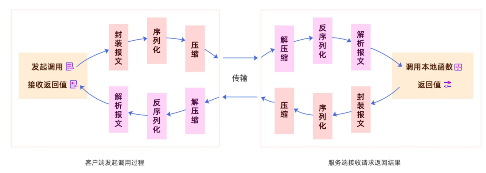
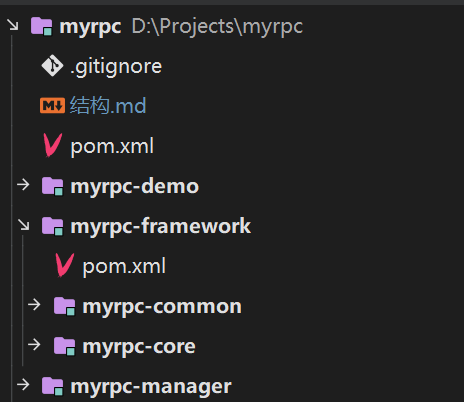
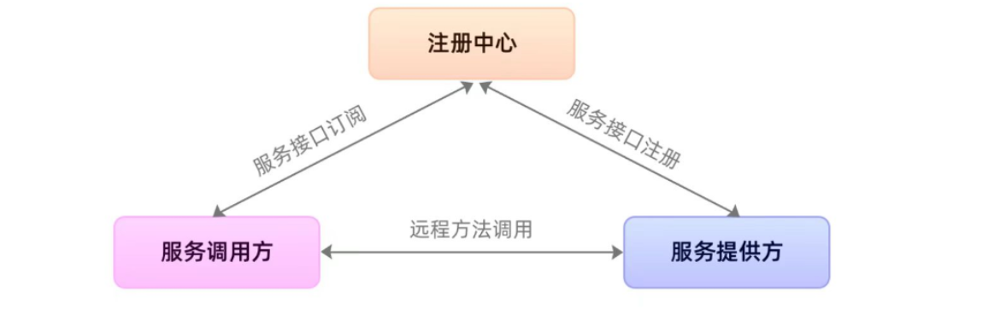
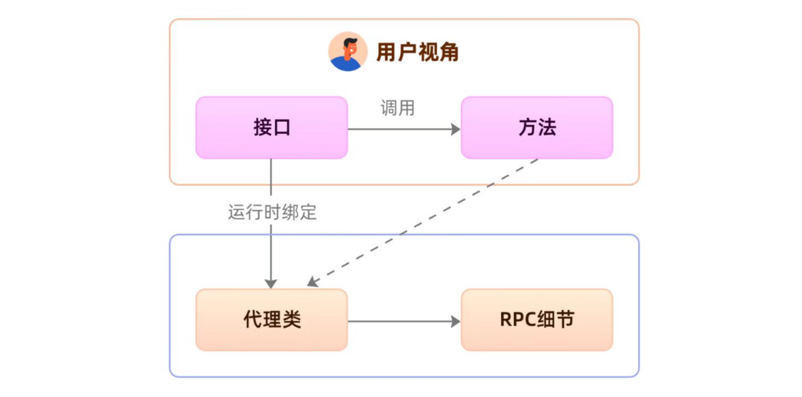
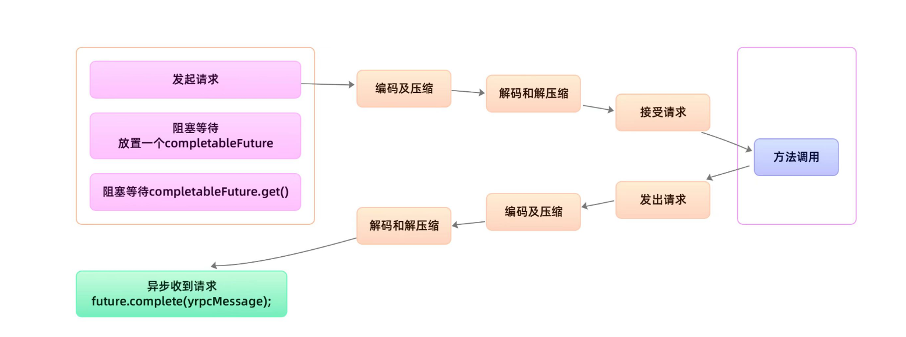
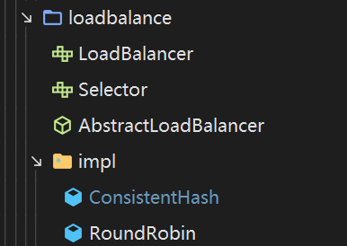

# 项目结构





```
myrpc
 myrpc-demo 测试
 myrpc-framework
    myrpc-core 核心包
    myrpc-common 公共包 
 myrpc-manager 管理zookeeper相关
```

# 服务注册与发现



## 1.服务注册

在Provider启动的时候，将对外暴露的接口注册到注册中心之中，注册中心将这个服务节点的 IP 和接口保存下来。

## 2.服务订阅

在Consumer启动的时候，去注册中心查找并订阅服务提供方的 IP，然后缓存到本地，并用于后续的远程调用。

## 核心类


### Registry

服务注册、发现的接口

 两个方法：向注册中心注册和拉取服务

```java
/**
 * 服务注册、发现的接口
 */
public interface Registry {
  /**
   * 注册发布服务
   * @param serviceConfig 服务配置内容
   */
  void register(ServiceConfig<?> serviceConfig);
  /**
   * 注册发布服务
   * @param port 注册端口
   * @param serviceConfig 服务配置内容
   */
  void register(ServiceConfig<?> serviceConfig,int port);
  /**
   * 从注册中心拉取服务列表
   * @return ip地址
   */
  List<InetSocketAddress> lookup(String serviceName);
}
```

### AbstractRegistry

抽象类实现,具体的实现由各注册中心自己实现

```java
/**
 * 抽象类实现接口
 */
public abstract class AbstractRegistry implements Registry{
}

```


### ZooKeeperRegistry(具体实现类)

继承抽象类AbstractRegistry,实现具体方法


# 客户端动态代理

```java
Hello hello = RpcClientProxy.get();
String server = hello.hello("server");
```



## 动态代理

注入需要远程调用的接口,通过ReferenceConfig的get()方法生成代理类,由代理类直接调用方法

```java
//  TestService接口
TestService testService = referenceConfig.get(); 
 String proxy = testService.test("12");
```

## Netty建立长连接

## 异步获取返回值

#### CompletableFuture

参考连接:https://zhuanlan.zhihu.com/p/344431341

通过CompletableFuture这个类进行异步调用

```java
// 放入数据get()方法可以拿到传入的数据
completableFuture.complete(obj);
// 阻塞方法,等待complete后才会完成
completableFuture.get(5, TimeUnit.SECONDS)
// 捕获异步调用失败异常
completableFuture.completeExceptionally(e)
```

get方法阻塞（拿到的是compete方法的参数），等待complete方法的执行



## 核心类

### RpcConsumerInvocationHandler

具体的动态代理细节

### ReferenceConfig

注解接口,通过get()方法进行动态代理

```java
/**
 * consumer注入接口
 * @param <T>
 */
@Data
@NoArgsConstructor
@Slf4j
public class ReferenceConfig<T> {

  private Class<T> interfaces;

  private Registry registry;
  /**
   * 动态代理
   * @return 远程调用的返回值
   */
  public T get() {
    ClassLoader classLoader = Thread.currentThread().getContextClassLoader();
    
    Class[] interfaces = new Class[]{this.interfaces};
    // RpcConsumerInvocationHandler具体代理细节
    Object proxyInstance = Proxy.newProxyInstance(classLoader, interfaces, new RpcConsumerInvocationHandler(registry,interfaces[0]));
    
    return (T) proxyInstance;
  }
}

```


# 封装报文

1. 4B magic 用于识别该报文 --> yang

2. 1B version 版本号 ----> 1

3. 2B header length 首部长度

4. 4B full length 报文总长度

   **设置长度是为防止粘包、黏包**

5. 1B requestType

6. 1B serializeType

7. 1B compressType

8. 8B requestId

9. body

# 负载均衡

# 配置类读取

# 编码

## myrpc-core 核心包

### 1.MyRpcBootStrap

  RPC服务启动器
  功能：1、向注册中心(注册服务和拉取服务  2、注入被调用的方法和接口


### 3.LoadBalancer



 负载均衡器接口, 定义了负载均衡的基本功能

- 根据服务名负载均衡选取一个可用ip
- 当感知节点发生了动态上下线，我们需要重新进行负载均衡

#### *AbstractLoadBalancer

负载均衡器模板，抽象了负载均衡的模板功能

#### *Selector

负载均衡算法选择器，由具体算法类实现他们自己的算法

