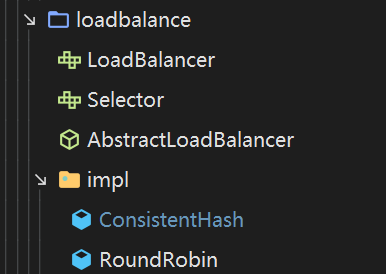

# 项目结构


```
myrpc
 myrpc-demo 测试
 myrpc-framework
    myrpc-core 核心包
    myrpc-common 公共包 
 myrpc-manager 管理zookeeper相关
```

# 服务注册与发现


# 客户端动态代理

# Netty建立长连接

# 封装报文

# 负载均衡

# 编码

## myrpc-core 核心包

### 1.MyRpcBootStrap

  RPC服务启动器
  功能：1、向注册中心(注册服务和拉取服务  2、注入被调用的方法和接口

### 2.Registry


服务注册、发现的接口

 功能：向注册中心注册和拉取服务

抽象类实现,具体的实现由各注册中心自己实现

### 3.LoadBalancer



 负载均衡器接口, 定义了负载均衡的基本功能

- 根据服务名负载均衡选取一个可用ip
- 当感知节点发生了动态上下线，我们需要重新进行负载均衡

#### *AbstractLoadBalancer

负载均衡器模板，抽象了负载均衡的模板功能

#### *Selector

负载均衡算法选择器，由具体算法类实现他们自己的算法

